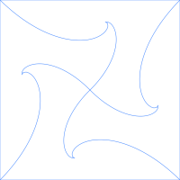

# Turtle

    
     
    

## Turtles in a PowerShell

[Turtle Graphics](https://en.wikipedia.org/wiki/Turtle_graphics) are a great way to learn programming and describe shapes.

Turtle graphics start really simple.

Imagine we are a turtle dragging a pen.  

We can draw almost any shape by moving.

We can only really move in two ways:

We can turn, and we can take a step forward.

Turtle graphics starts with these two operations:

* Rotate() rotates the turtle
* Forward() moves forward

We can easily keep a list of these steps in memory, and draw them with [SVG](https://developer.mozilla.org/en-US/docs/Web/SVG).

We can make Turtle in any language.

This module makes Turtle in PowerShell.
### Installing and Importing

We can install Turtle from the PowerShell Gallery:

~~~PowerShell
Install-Module Turtle -Scope CurrentUser -Force
~~~

Then we can import it like any other module

~~~PowerShell
Import-Module Turtle -Force -PassThru
~~~

#### Cloning and Importing

You can also clone the repository and import the module

~~~PowerShell

git clone https://github.com/PowerShellWeb/Turtle
cd ./Turtle
Import-Module ./ -Force -PassThru

~~~

### Turtle GitHub Action

Turtle has a GitHub action, and can be run in a workflow.

To use the turtle action, simply refer to this repository:

~~~yaml
- name: UseTurtle
  uses: StartAutomating/Turtle@main
~~~

This will run any *.turtle.ps1 files found in your repository, and check in any files that have changed.

What does this give us?

**We Can Generate Turtle Graphics in GitHub Workflows**

### Getting Started

Once we've imported Turtle, we can create any number of turtles, and control them with commands and methods.

The turtle is represented as an object, and any number of commands can make or move turtles.

* New-Turtle created a turtle
* Move-Turtle performs a single turtle movement
* Set-Turtle changes the turtle's properties
* Save-Turtle saves the output of a turtle.

Last but not least:  Get-Turtle lets you run multiple steps of turtle, and is aliased to 	urtle.

Get-Turtle is the command we will use most often, and we will almost always just call it by the alias 	urtle.

If you want to get a sense of all that Turtle can do, check out the [Get-Turtle examples](https://psturtle.com/Commands/Get-Turtle)

### Drawing Squares

Let's start simple, by drawing a square with a series of commands.

~~~PowerShell

turtle Forward 10 Rotate 90 |
    turtle Forward 10 Rotate 90 |
    turtle Forward 10 Rotate 90 |
    turtle Forward 10 Rotate 90 |    
    Save-Turtle "./Square.svg"

~~~

We can also write this using a method chain:

~~~PowerShell
$turtle = New-Turtle
$turtle.
    Forward(10).Rotate(90).
    Forward(10).Rotate(90).
    Forward(10).Rotate(90).
    Forward(10).Rotate(90).
    Symbol.Save("$pwd/Square.svg")
~~~

Or we could use a loop:

~~~PowerShell
$turtle = New-Turtle
foreach ($n in 1..4) {
    $turtle = $turtle.Forward(10).Rotate(90)
}
$turtle | Save-Turtle ./Square.svg
~~~

Or we could use `Get-Turtle` directly.

~~~PowerShell
turtle forward 10 rotate 90 forward 10 rotate 90 forward 10 rotate 90 forward 10 rotate 90 |
    Save-Turtle ./Square.svg
~~~

Or we could use `Get-Turtle` with a bit of PowerShell multiplication magic:

~~~PowerShell
turtle ('forward',10,'rotate',90 * 4) |
    Save-Turtle ./Square.svg
~~~

This just demonstrates how we can construct shapes out of these two simple primitive steps.

There are a shell of a lot of ways you can draw any shape.

Turtle has many methods to help you draw, including a convenience method for squares.

So our shortest square can be written as:

~~~PowerShell
turtle square 10 | Save-Turtle ./Square.svg
~~~

### Drawing Other Shapes

We can use the same techniques to construct other shapes.

For example, this builds us a hexagon:

~~~PowerShell
$turtle = New-Turtle

foreach ($n in 1..6) {
    $turtle = $turtle.Forward(10).Rotate(60)
}

$turtle | 
    Save-Turtle "./Hexagon.svg" 
~~~

Because this Turtle generates SVG, we can also use it to create patterns.

~~~PowerShell

    turtle ('Forward', 10, 'Rotate', 60  * 6) | 
        Set-Turtle -Property Stroke '#4488ff' |
        Save-Turtle -Path ./Examples/HexagonPattern.svg -Property Pattern

~~~

### Drawing Fractals

Turtle is can be used to draw fractals.

Many fractals can be described in something called a [L-System](https://en.wikipedia.org/wiki/L-system) (short for Lindenmayer system)

L-Systems describe: 

* An initial state (called an Axiom)
* A series of rewriting rules
* The way each variable should be interpreted.

For example, let's show how we contruct the [Box Fractal](https://en.wikipedia.org/wiki/Vicsek_fractal)

Our Axiom is F-F-F-F.

This should look familiar:  it's a shorthand for the squares we drew earlier.

It basically reads "go forward, then left, four times"

Our Rule is F = 'F-F+F+F-F'.

This means every time we encounter F, we want to replace it with F-F+F+F-F.

This will turn our one box into 6 new boxes.  If we repeat it again, we'll get 36 boxes.  Once more and we're at 216 boxes.

Lets show the first three generations of the box fractal:

~~~PowerShell

    Turtle BoxFractal 5 1 |
    Set-Turtle Stroke '#4488ff' |
    Save-Turtle ./Examples/BoxFractal1.svg

    Turtle BoxFractal 5 2 |
    Set-Turtle Stroke '#4488ff' |
    Save-Turtle ./Examples/BoxFractal2.svg

    Turtle BoxFractal 5 3 |
    Set-Turtle Stroke '#4488ff' |
    Save-Turtle ./Examples/BoxFractal3.svg

~~~

This implementation of Turtle has quite a few built-in fractals.

For example, here is an example of a pattern comprised of Koch Snowflakes:

~~~PowerShell

    turtle KochSnowflake 2.5 4 |     
        Set-Turtle -Property StrokeWidth '0.1%' | 
        Set-Turtle -Property Stroke '#4488ff' | 
        Set-Turtle -Property PatternTransform -Value @{scale = 0.5 } |
        Save-Turtle -Path ./Examples/KochSnowflakePattern.svg -Property Pattern

~~~

We can also animate the pattern, for endless variety:

~~~PowerShell
$turtle = turtle KochSnowflake 10 4 | 
    Set-Turtle -Property PatternTransform -Value @{scale=0.33} |
    set-turtle -property Fill -value '#4488ff' |
    Set-Turtle -Property PatternAnimation -Value ([Ordered]@{
        type = 'scale'    ; values = 0.66,0.33, 0.66 ; repeatCount = 'indefinite' ;dur = "23s"; additive = 'sum'
    }, [Ordered]@{
        type = 'rotate'   ; values = 0, 360 ;repeatCount = 'indefinite'; dur = "41s"; additive = 'sum'
    }, [Ordered]@{
        type = 'skewX'    ; values = -30,30,-30;repeatCount = 'indefinite';dur = "83s";additive = 'sum'
    }, [Ordered]@{
        type = 'skewY'    ; values = 30,-30, 30;repeatCount = 'indefinite';additive = 'sum';dur = "103s"
    }, [Ordered]@{
        type = 'translate';values = "0 0","42 42", "0 0";repeatCount = 'indefinite';additive = 'sum';dur = "117s"
    })    
    
$turtle | save-turtle -Path ./EndlessSnowflake.svg -Property Pattern
Pop-Location
~~~

### Turtles all the way down

A turtle can contain turtles, which can contain turtles, which can contain turtles ...

We call this 'Turtles All The Way Down', and it lets us do two very important sets of things:

* It allows turtles to interact
* It allows us to model the behavior of multiple turtles

Let's start with a couple of cool practical examples.

Imagine we are four turtles in a square, each trying to catch up with the next turtle.

What kind of shape do you think our paths will draw?

~~~PowerShell
.SYNOPSIS
    Follow that Turtle!
.DESCRIPTION
    Basic behavior modelling with Turtle.

    A series of turtles will follow the next turtle.
#>
param(
# The size of the square
[double]
$Size = 200,

# The speed of each turtle
[double]
$Speed = 1,

# The number of steps
[int]
$StepCount
)

# If no steps were provided
if (-not $StepCount) {
    # double the size and divide by speed
    $StepCount = ($size * 2)/$speed
}

# Set up our turtles.
$followThatTurtle = turtle square $Size turtles ([Ordered]@{
    t1 = turtle teleport 0 0 
    t2 = turtle teleport $Size 0 
    t3 = turtle teleport $Size $Size 
    t4 = turtle teleport 0 $Size
})

# For each step
foreach ($n in 1..([Math]::Abs($StepCount))) {
    # Go to each turtle
    for ($turtleNumber = 0; $turtleNumber -lt $followThatTurtle.Turtles.Count; $turtleNumber++) {        
        $thisTurtle = $followThatTurtle.Turtles[$turtleNumber]
        # and find the next turtle
        $nextTurtle = if ($turtleNumber -eq $followThatTurtle.Turtles.Count - 1) {
            $followThatTurtle.Turtles[0]
        } else {
            $followThatTurtle.Turtles[$turtleNumber + 1]
        }
        # If we are more than 1 unit away
        if ($thisTurtle.Distance($nextTurtle) -ge 1) {
            # rotate towards it 
            $null = $thisTurtle.Rotate(
                $thisTurtle.Towards($nextTurtle)
            ).Forward($Speed) # and move forward.
        }        
    }
}

$followThatTurtle | turtle save ./FollowThatTurtle.svg
$followThatTurtle.Stroke = 'transparent'
$followThatTurtle | Save-Turtle ./FollowThatTurtlePattern.svg Pattern

~~~

Let's see it as a pattern:

Now let's imagine we have four turtles in the center, and they're trying to get away from the turtles in the corners.

What kind of shape will this produce?

~~~PowerShell
.SYNOPSIS
    Hide and Seek
.DESCRIPTION
    Simple behavior modelling with Turtle.
.NOTES
    Imagine we have eight turtles playing hide and seek

    Four turtles are seeking.

    Four turtles are hiding.

    Each hiding turtle starts in the center.

    Each seeking turtle will chase a hiding turtle.

    Each hiding turtle will run away at an angle (by default 90 degrees).
#>
param(
[double]
$SquareSize = 420,
[double]
$HiderSpeed = 2,
[double]
$SeekerSpeedRatio = ((1 + [Math]::Sqrt(5))/2),
[double]
$EvadeAngle = 90
)

if ($PSScriptRoot) { Push-Location $PSScriptRoot}

$midpoint = ($squareSize/2), ($squareSize/2)
$seekerSpeed = $HiderSpeed * $SeekerSpeedRatio # (1 + (Get-Random -Min 10 -Max 50)/50) # (Get-Random -Min 1 -Max 5)
$stepCount = $squareSize/2 * (1 + ([Math]::Abs($attackerSpeed - $evaderSpeed)))

$hideAndSeek = turtle square $squareSize stroke '#4488ff' turtles ([Ordered]@{
    s1 = turtle teleport 0 0 stroke '#4488ff' # stroke 'red' pathclass 'red-stroke' fill red
    s2 = turtle teleport $squareSize stroke '#4488ff' 0 # stroke 'yellow' pathclass 'yellow-stroke' fill yellow
    s3 = turtle teleport $squareSize $squareSize stroke '#4488ff' # stroke 'green' pathclass 'green-stroke' fill green
    s4 = turtle teleport 0 $squareSize stroke '#4488ff' # stroke 'blue' PathClass 'blue-stroke' fill blue
    h1 = turtle teleport $midpoint stroke '#4488ff' # stroke 'red' fill 'red'
    h2 = turtle teleport $midpoint stroke '#4488ff' # stroke 'yellow' fill 'yellow'
    h3 = turtle teleport $midpoint stroke '#4488ff' # stroke 'green' fill 'green'
    h4 = turtle teleport $midpoint stroke '#4488ff' # stroke 'blue' fill 'blue'
})

# Since all attackers and evaders start with equal distances, 
# when we have caught one we have caught them all.
:caughtEm foreach ($n in 1..$stepCount) {

    # Get the seeker turtles
    $seekers = $hideAndSeek.Turtles[@($hideAndSeek.Turtles.Keys -match '^s')]
    # Get the hiding turtles
    $hiders = $hideAndSeek.Turtles[@($hideAndSeek.Turtles.Keys -match '^h')]

    for ($hiderNumber = 0; $hiderNumber -lt $hiders.Length; $hiderNumber++) {
        $thisTurtle = $hiders[$hiderNumber]
        $runningAwayFrom = $seekers[$hiderNumber % $seekers.Length]
        $null = $thisTurtle.Rotate(
            $thisTurtle.Towards($runningAwayFrom) + $evadeAngle # (Get-Random -Minimum 80 -Maximum 100)
        ).Forward($HiderSpeed)
    }
    
    for ($seekerNumber = 0; $seekerNumber -lt $seekers.Length; $seekerNumber++) {
        $thisTurtle = $seekers[$seekerNumber]
        $runningTowards = $hiders[$seekerNumber % $hiders.Length]
        $null = $thisTurtle.Rotate(
            $thisTurtle.Towards($runningTowards) # + (Get-Random -Minimum -10 -Maximum 10)
        ).Forward($seekerSpeed)
    }

    for ($seekerNumber = 0; $seekerNumber -lt $seekers.Length; $seekerNumber++) {
        $thisTurtle = $seekers[$seekerNumber]        
        $runningTowards = $hiders[$seekerNumber % $hiders.Length]
        if ($thisTurtle.Distance($runningTowards) -le 1) {
            break caughtEm
        }
    }
}

$hideAndSeek | turtle save ./FollowThatTurtleHideAndSeek.svg
$hideAndSeek.Stroke = 'transparent'
$hideAndSeek | Save-Turtle ./FollowThatTurtleHideAndSeekPattern.svg Pattern

if ($PSScriptRoot) { Pop-Location}
~~~

Let's see it as a pattern:

### Turtles in HTML

SVG is HTML.

So, because our Turtle is built atop of an SVG path, our Turtle _is_ HTML.

Don't believe me?  Try this?

~~~PowerShell
turtle SierpinskiTriangle |
    Set-Turtle Stroke '#4488ff' | 
    Save-Turtle ./SierpinskiTriangle.html
~~~

Anything we do with our turtle should work within a webpage.

To include a Turtle in a page, we can simply stringify it:

~~~PowerShell
"$(turtle SierpinskiTriangle)"
~~~

There are a few properties of the turtle that may be helpful:

* .Canvas returns the turtle rendered in an HTML canvas
* .OffsetPath returns the turtle as an offset path

### Turtles in Raster

Because our Turtle can be painted onto an HTML canvas, we can easily turn it into a raster format, like PNG.

This works by launching the browser in headless mode, rasterizing the image, and returning the bytes.

Any turtle can be saved as a PNG, JPEG, and WEBP.

~~~PowerShell
turtle SierpinskiTriangle |
    Set-Turtle Stroke '#4488ff' | 
    Save-Turtle ./SierpinskiTriangle.png
~~~

### Turtles are Cool

You should now have some sense of how cool Turtle graphics can be, and how easy it is to get stared.

Play around.  Draw something.  Please provide feedback by filing an issue or starting a discussion.

Open an issue if you want a new shape or fractal.  

File a pull request if you have some cool changes to make.

Have fun!

Hope this helps!

